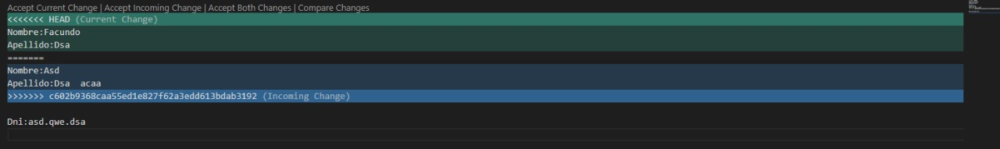
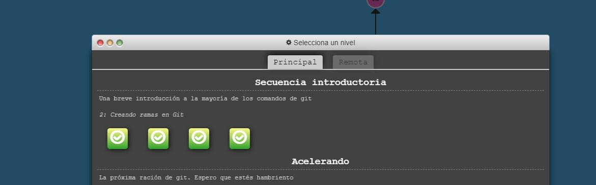

 - Practico 1
Repo aca https://github.com/facundosoria/Lab4-Practico1

 - Punto 4

CONFLICT (content): Merge conflict in Cv.md

- Punto 5
Tiene 2 cambios en la imagen el nombre y en el apellido, pero el conflicto se hace en la misma misma parte del codigo

[

-Punto 6

[

